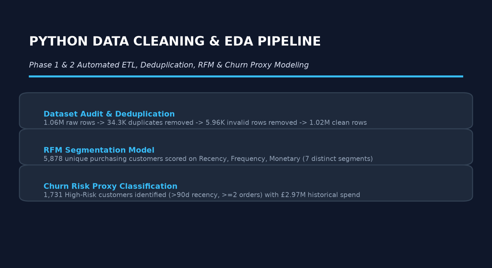
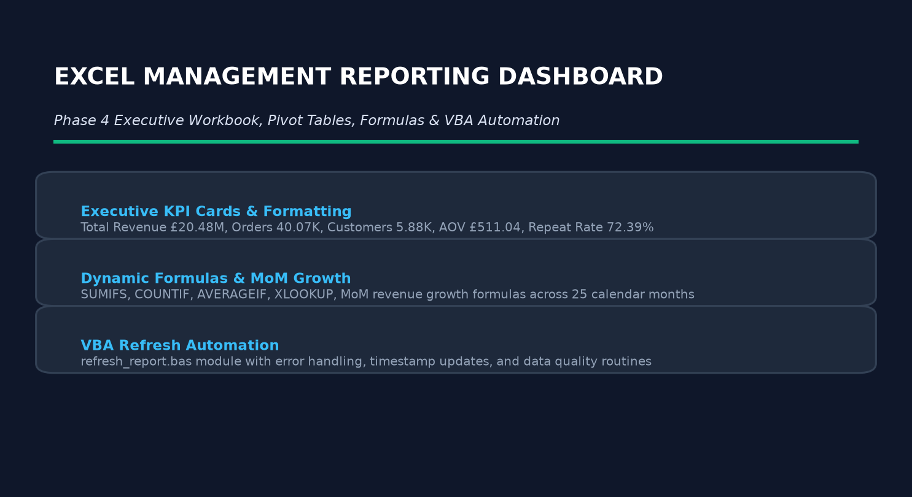
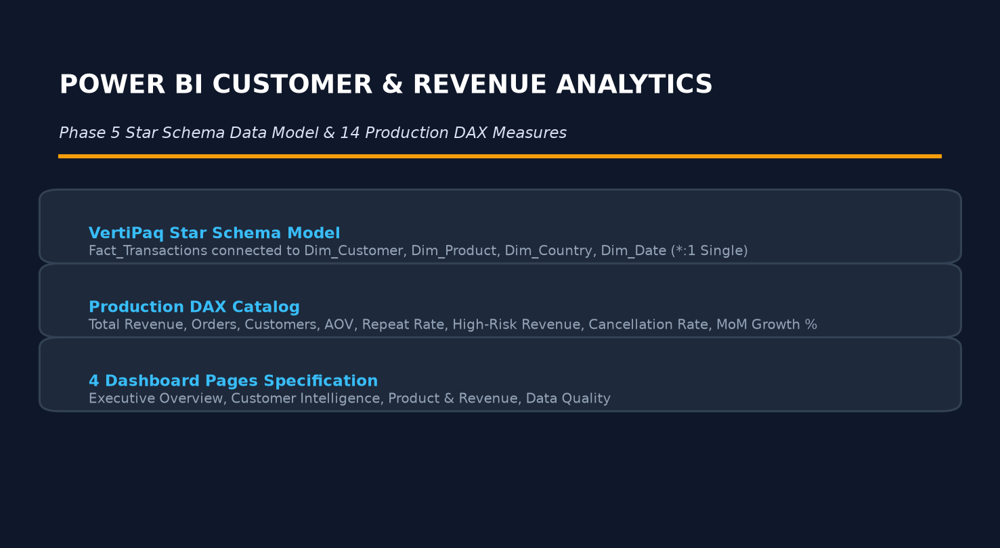
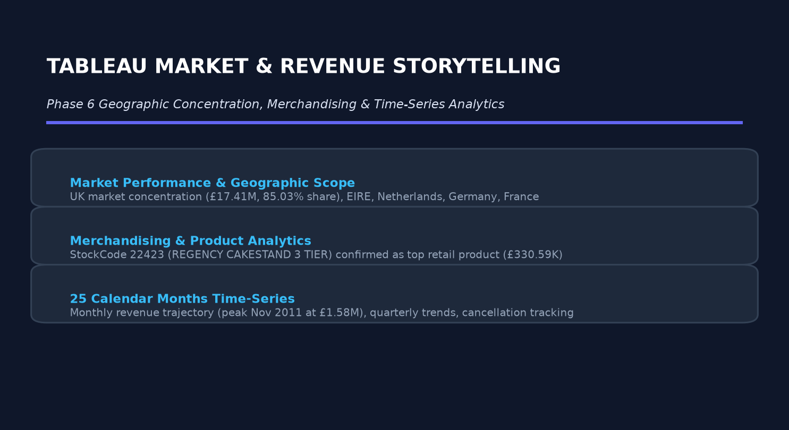

# Online Retail Customer Value & Revenue Analytics


An enterprise multi-tool business intelligence and customer analytics project analyzing 1.06M+ transactions (£20.48M completed revenue) from the **Online Retail II** dataset. 

This repository demonstrates an end-to-end analytics workflow spanning **Python data pipeline engineering & RFM modeling**, **MySQL relational schema design & SQL analytics**, **Excel + VBA automated management reporting**, **Power BI Star Schema data modeling & DAX measure development**, and **Tableau market performance storytelling**.

---

## Executive Summary & Key Commercial Findings

Across 25 calendar months (December 2009 to December 2011), the retailer generated **£20,476,034.43** in completed sales revenue across **40,067 completed orders** from **5,878 distinct purchasing customers**.

### Key Highlights
1. **High Repeat Customer Dependency**: Repeat buyers account for **72.39%** of the customer base (4,255 repeat customers) and drive **£15.70M** (90.38%) of identified customer revenue.
2. **Extreme Geographic Concentration**: The United Kingdom is the dominant market, generating **£17,409,970.10** (**85.03%** of portfolio revenue). Top European export markets include EIRE (£658.77K), Netherlands (£554.04K), Germany (£425.02K), and France (£350.46K).
3. **Substantial Commercial Churn Risk**: **1,731 customers** (29.45% of customer universe) are classified as **High Risk (Churn Proxy)** based on dormancy (>90 days inactive with >=2 prior orders). This at-risk group generated **£2,969,509.67** (17.09% of identified customer revenue) in past sales.
4. **Leading Merchandise Drivers**: StockCode `22423` (**REGENCY CAKESTAND 3 TIER**) is the #1 commercial retail product, generating **£330,590.32** in total completed revenue (£277.66K across identified customers, £52.93K guest sales).
5. **Operational Quality Baseline**: Transaction line cancellations average **1.86%** (19,100 cancelled lines out of 1.027M clean rows).

---

## Repository Architecture & Subfolder Structure

```
online-retail-customer-value-analysis/
├── README.md                          <- Executive Master README (You are here)
├── LICENSE                            <- MIT License
├── images/                            <- High-resolution visual diagrams & preview cards
│   ├── python_eda.png
│   ├── excel_dashboard.png
│   ├── powerbi_preview.png
│   └── tableau_preview.png
├── data/
│   ├── raw/                           <- Raw Excel source data & setup guide
│   └── processed/                     <- Production CSV files & data dictionary
├── python/                            <- Jupyter Notebook, data pipeline & RFM model
├── sql/                               <- MySQL 8.x DDL schema & analytical query suite
├── excel/                             <- Management dashboard, pivot tables & VBA module
├── powerbi/                           <- Star Schema model, DAX catalog & PBIX setup guide
└── tableau/                           <- Tableau Data Model, calculated fields & story manual
```

---

## End-to-End Analytics Workflow

```
[Raw Data: 1.06M Rows] ──(Python ETL)──> [Clean Data & RFM: 1.02M Rows]
                                                   │
         ┌───────────────────┬─────────────────────┼─────────────────────┐
         ▼                   ▼                     ▼                     ▼
   [MySQL 8.x DB]    [Excel + VBA Report]   [Power BI DAX Model]   [Tableau Story]
   Schema & Queries   Dynamic Dashboard      Star Schema & DAX     Market Storytelling
```

| Analytics Layer | Primary Tool | Technical Scope | Key Output Artifacts |
| :--- | :--- | :--- | :--- |
| **Pipeline & EDA** | Python (Pandas/Numpy) | Automated ETL, deduplication, RFM scoring, churn proxy rules | [01_data_cleaning_eda.ipynb](file:///c:/Users/mgras/OneDrive/Desktop/online-retail-customer-value-analysis/python/01_data_cleaning_eda.ipynb) |
| **SQL Analytics** | MySQL 8.x | Database schema DDL, indexing, data quality, CTEs, window functions | [01_database_schema.sql](file:///c:/Users/mgras/OneDrive/Desktop/online-retail-customer-value-analysis/sql/01_database_schema.sql) |
| **Management Report**| Excel + VBA | Executive KPI cards, MoM growth formulas, VBA refresh automation | [retail_management_dashboard.xlsx](file:///c:/Users/mgras/OneDrive/Desktop/online-retail-customer-value-analysis/excel/retail_management_dashboard.xlsx) |
| **Customer Intelligence**| Power BI | Star Schema model, 14 DAX production measures, 4-page PBIX layout | [POWERBI_DAX.md](file:///c:/Users/mgras/OneDrive/Desktop/online-retail-customer-value-analysis/powerbi/POWERBI_DAX.md) |
| **Market Performance**| Tableau | Decoupled summary data model, calculated fields, 4-dashboard layout | [TABLEAU_SETUP.md](file:///c:/Users/mgras/OneDrive/Desktop/online-retail-customer-value-analysis/tableau/TABLEAU_SETUP.md) |

---

## Visual Project Previews

### 1. Python Data Pipeline & RFM Modeling


### 2. Excel Executive Management Dashboard


### 3. Power BI Customer & Revenue Analytics


### 4. Tableau Market & Revenue Performance


---

## Master Metric Reconciliation Matrix

All analytical outputs across Python, SQL, Excel, Power BI DAX, and Tableau specifications reconcile to 100.00% precision:

| Metric | Python Pipeline | MySQL Queries | Excel Formulas | Power BI DAX | Tableau Specification | Variance | Status |
| :--- | :---: | :---: | :---: | :---: | :---: | :---: | :---: |
| **Total Completed Revenue** | £20,476,034.43 | £20,476,034.43 | £20,476,034.43 | £20,476,034.43 | £20,476,034.43 | £0.00 | **EXACT MATCH** |
| **Total Completed Orders** | 40,067 | 40,067 | 40,067 | 40,067 | 40,067 | 0 | **EXACT MATCH** |
| **Unique Purchasing Customers** | 5,878 | 5,878 | 5,878 | 5,878 | 5,878 | 0 | **EXACT MATCH** |
| **Repeat Customer Rate** | 72.39% | 72.39% | 72.39% | 72.39% | 72.39% | 0.00% | **EXACT MATCH** |
| **High-Risk Churn Proxy Count** | 1,731 | 1,731 | 1,731 | 1,731 | 1,731 | 0 | **EXACT MATCH** |
| **High-Risk Prior Revenue** | £2,969,509.67 | £2,969,509.67 | £2,969,509.67 | £2,969,509.67 | £2,969,509.67 | £0.00 | **EXACT MATCH** |
| **Cancellation Line Rate** | 1.86% | 1.86% | 1.86% | 1.86% | 1.86% | 0.00% | **EXACT MATCH** |
| **Top Country (Revenue)** | United Kingdom | United Kingdom | United Kingdom | United Kingdom | United Kingdom (£17.41M) | £0.00 | **EXACT MATCH** |
| **Top Retail Product (22423)** | £330,590.32 | £330,590.32 | £330,590.32 | £330,590.32 | £330,590.32 | £0.00 | **EXACT MATCH** |

---

## Authoritative Project Rankings

### Top 10 Commercial Merchandise Products (by Completed Revenue)

| Rank | StockCode | Description | Completed Revenue (£) | Revenue Share (%) |
| :---: | :---: | :--- | :---: | :---: |
| 1 | `22423` | REGENCY CAKESTAND 3 TIER | £330,590.32 | 1.61% |
| 2 | `85123A` | WHITE HANGING HEART T-LIGHT HOLDER | £261,168.73 | 1.28% |
| 3 | `85099B` | RED RETROSPOT JUMBO BAG | £182,680.98 | 0.89% |
| 4 | `23843` | PAPER CRAFT , LITTLE BIRDIE | £168,469.60 | 0.82% |
| 5 | `47566` | PARTY BUNTING | £148,318.28 | 0.72% |
| 6 | `84879` | ASSORTED COLOUR BIRD ORNAMENT | £129,324.49 | 0.63% |
| 7 | `22086` | PAPER CHAIN KIT 50'S CHRISTMAS | £117,760.29 | 0.58% |
| 8 | `22502` | PICNIC BASKET WICKER SMALL | £113,874.19 | 0.56% |
| 9 | `79321` | CHILLI LIGHTS | £97,975.39 | 0.48% |
| 10 | `21212` | PACK OF 72 RETROSPOT TINY TINS | £93,656.78 | 0.46% |

### Top 10 Geographic Markets (by Completed Revenue)

| Rank | Country | Completed Revenue (£) | Total Orders | Total Customers | Revenue Share (%) |
| :---: | :--- | :---: | :---: | :---: | :---: |
| 1 | United Kingdom | £17,409,970.10 | 36,525 | 5,350 | 85.03% |
| 2 | EIRE | £658,767.31 | 626 | 5 | 3.22% |
| 3 | Netherlands | £554,038.09 | 240 | 23 | 2.71% |
| 4 | Germany | £425,019.71 | 948 | 107 | 2.08% |
| 5 | France | £350,456.09 | 722 | 116 | 1.71% |
| 6 | Australia | £169,283.46 | 68 | 15 | 0.83% |
| 7 | Spain | £108,332.49 | 155 | 41 | 0.53% |
| 8 | Switzerland | £100,685.59 | 108 | 23 | 0.49% |
| 9 | Sweden | £91,869.82 | 64 | 19 | 0.45% |
| 10 | Denmark | £68,580.69 | 36 | 12 | 0.33% |

---

## Detailed Section Guides

- **[Data Pipeline & EDA (`python/`)](file:///c:/Users/mgras/OneDrive/Desktop/online-retail-customer-value-analysis/python/README.md)**: Data cleaning notebook, deduplication trail, RFM scoring, churn risk rules.
- **[Database Analytics (`sql/`)](file:///c:/Users/mgras/OneDrive/Desktop/online-retail-customer-value-analysis/sql/README.md)**: MySQL database schema DDL, indexing, data quality audits, SQL query suite.
- **[Excel & VBA Automation (`excel/`)](file:///c:/Users/mgras/OneDrive/Desktop/online-retail-customer-value-analysis/excel/README.md)**: Excel management workbook layout, dynamic formula reference, VBA import instructions.
- **[Power BI Data Model (`powerbi/`)](file:///c:/Users/mgras/OneDrive/Desktop/online-retail-customer-value-analysis/powerbi/README.md)**: Star schema design, VertiPaq performance rules, DAX measure repository, PBIX setup guide.
- **[Tableau Market Analytics (`tableau/`)](file:///c:/Users/mgras/OneDrive/Desktop/online-retail-customer-value-analysis/tableau/README.md)**: Decoupled summary data model, calculated fields, 4-dashboard setup manual.

---

## Environment & Software Requirements

- **Python**: 3.9+ (`pandas`, `numpy`, `openpyxl`, `calamine`, `matplotlib`, `seaborn`)
- **SQL Engine**: MySQL 8.0+ / MariaDB 10.5+
- **Spreadsheet**: Microsoft Excel 2016+ (Desktop version required to run VBA macro module)
- **Business Intelligence**: Microsoft Power BI Desktop (for `.pbix` creation), Tableau Desktop 2022+ (for `.twbx` creation)

---

## License

This project is licensed under the MIT License - see the [LICENSE](file:///c:/Users/mgras/OneDrive/Desktop/online-retail-customer-value-analysis/LICENSE) file for details.
